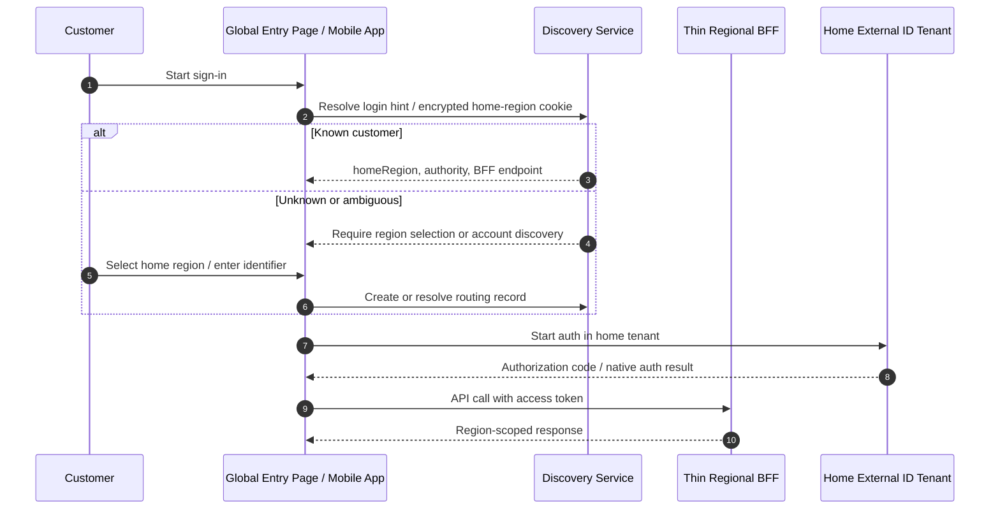
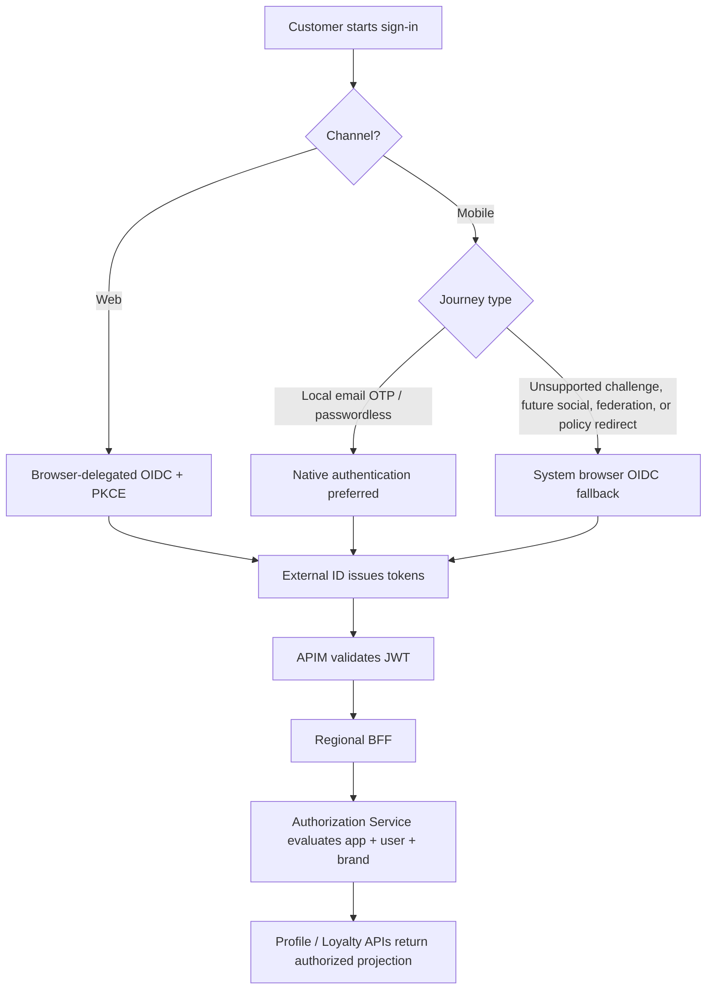
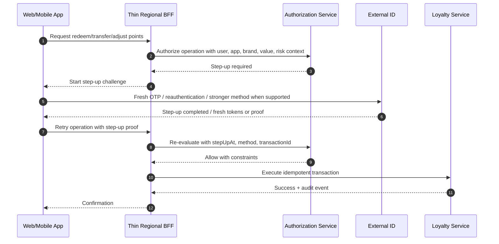
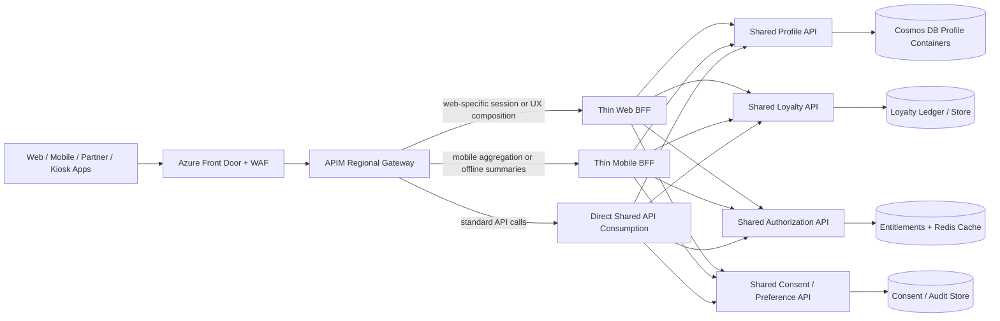
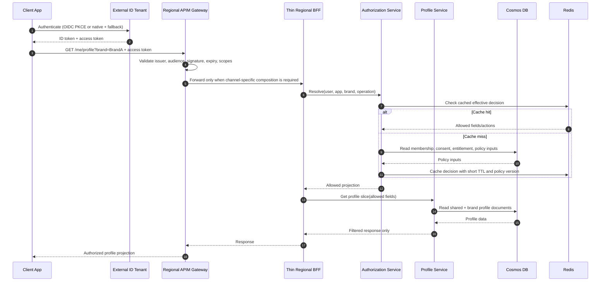
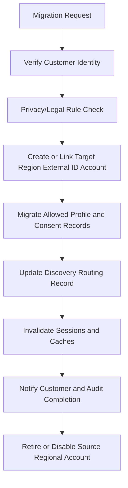
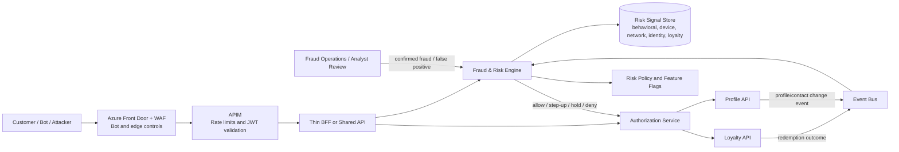
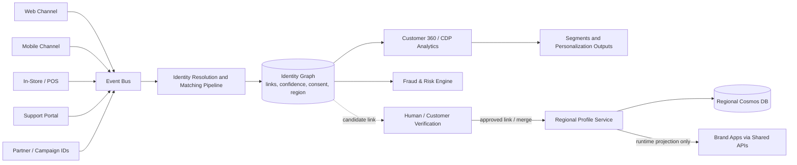
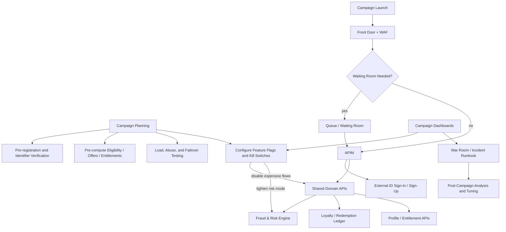

<table>


# 1. Executive Summary

This document improves the consolidated identity architecture for a global, multi-brand customer loyalty platform using Microsoft Entra External ID. The design assumes one umbrella enterprise operating multiple customer-facing brands in the United States, European Union / EEA, and Asia-Pacific, with customer account portability, brand-specific data isolation, strong data-minimization controls, and scalable authentication for millions of customers.

The recommended architecture is not a single global identity tenant. It uses two dedicated Microsoft Entra External ID external tenants at launch - one in the United States and one in the European Union - with an APAC tenant introduced only when a business, latency, or regulatory trigger justifies it. This pattern balances regulatory defensibility, operational simplicity, SSO scope, and future extensibility.

| **Decision Area**             | **Recommendation**                                                                                                                                                                                                        | **Why It Matters**                                                                                                                                                                      |
|-------------------------------|---------------------------------------------------------------------------------------------------------------------------------------------------------------------------------------------------------------------------|-----------------------------------------------------------------------------------------------------------------------------------------------------------------------------------------|
| Identity tenancy              | Two External ID tenants at launch: US and EU; APAC as trigger-based expansion.                                                                                                                                            | Aligns EU customer identity data with EU data boundary posture while avoiding premature APAC operational overhead.                                                                      |
| Routing                       | Global Discovery Service stores only minimal routing metadata and always routes users to their home identity region.                                                                                                      | Prevents duplicate accounts and avoids geolocation-based misrouting when users travel.                                                                                                  |
| Authentication UX             | Browser-delegated OIDC is the strategic baseline; native authentication can be used for mobile journeys where UX control outweighs SSO/federation constraints. Browser fallback is mandatory.                             | Preserves standards alignment, SSO, social/federated IdP compatibility, and resilience.                                                                                                 |
| Authorization                 | External ID authenticates users; application services authorize access using app identity, user context, brand context, and field-level projection.                                                                       | Keeps tokens lean and prevents business authorization sprawl across clients and microservices.                                                                                          |
| Profile data                  | Cosmos DB is the system of record for customer profile, brand memberships, loyalty state, consent, and entitlements; External ID stores only identity-centric attributes.                                                 | Supports scale, data residency, isolation, and business model flexibility.                                                                                                              |
| API architecture              | Azure Front Door + WAF, APIM Premium multi-region gateways, shared regional domain APIs, and optional thin BFFs for channel-specific composition.                                                                         | Enforces Zero Trust boundaries while avoiding BFF-per-application duplication as brands and channels are added.                                                                         |
| Brand isolation               | Separate brand containers plus policy-based field projection and brand-scoped API products.                                                                                                                               | Prevents accidental cross-brand leakage while enabling governed shared loyalty insights.                                                                                                |
| Fraud and risk                | Add a regional Fraud & Risk Engine integrating behavioral analytics, device signals, bot detection, velocity rules, and feedback into step-up, throttling, and loyalty controls.                                          | Protects promotions and loyalty value from credential stuffing, fake-account creation, account takeover, bot abuse, and points fraud.                                                   |
| Identity Graph / Customer 360 | Create a governed Customer 360 / Identity Graph layer separate from the authentication directory and operational profile APIs.                                                                                            | Supports cross-channel linking, deduplication, consent-aware personalization, and analytics without turning External ID into the customer master.                                       |
| Campaign and peak scaling     | Add a formal campaign readiness model with pre-registration, virtual waiting rooms/queues where appropriate, warm-up, feature flags, and degradation modes.                                                               | Prevents marketing campaigns from overwhelming sign-up/sign-in, profile, entitlement, and loyalty redemption paths.                                                                     |
| Tenant configuration drift    | Manage External ID tenant configuration and app registrations as identity infrastructure-as-code with automated drift detection, template-based app registration factory, synthetic auth testing, and evidence retention. | Prevents regional inconsistencies, app registration sprawl, unauthorized redirect URI changes, token-claim drift, Conditional Access drift, and audit gaps as brands and regions scale. |


# 2. Architecture Principles

| **Principle**                           | **Design Implication**                                                                                                                                                                      |
|-----------------------------------------|---------------------------------------------------------------------------------------------------------------------------------------------------------------------------------------------|
| Home-region identity ownership          | A customer belongs to exactly one identity home region. Physical location does not change the identity authority.                                                                           |
| Identity is not the profile store       | External ID stores sign-in identifiers, authentication methods, user flows, and minimal custom attributes. Rich customer profile and loyalty state belong in application-owned data stores. |
| Lean tokens, rich server-side policy    | Tokens carry stable identity and coarse authorization signals only; detailed brand entitlements and field access are resolved server-side.                                                  |
| Regional autonomy with global standards | US and EU stacks use the same IaC, API contracts, telemetry schema, CI/CD gates, and security baseline, but operate with regional tenants and data stores.                                  |
| Configuration-driven brand onboarding   | New brands should be added through app registrations, APIM products, brand containers, policies, branding, and routing configuration rather than architectural redesign.                    |
| Fail safely                             | Regional identity failover must not silently move users to a different tenant. Application read-only degradation is acceptable; wrong-region authentication is not.                         |
| Data minimization by design             | The global layer must not become a hidden master customer profile. It should store only identifiers required for routing and account correlation.                                           |

# 3. Target Reference Architecture

The platform is organized around a global entry layer and two regional identity/application/data stacks. The regional stacks are peers. They share implementation patterns, not live customer profile data. The Global Discovery Service decides the customer home region before authentication begins, then directs the client to the right tenant, regional BFF, and regional API endpoint.

## 3.1 Component View

| **Layer**                     | **Components**                                                                                       | **Primary Responsibility**                                                                                                                                                                                     |
|-------------------------------|------------------------------------------------------------------------------------------------------|----------------------------------------------------------------------------------------------------------------------------------------------------------------------------------------------------------------|
| Global edge                   | Azure Front Door, WAF, custom domains, global entry pages                                            | Global ingress, TLS termination, WAF enforcement, traffic steering, and initial access to the discovery workflow.                                                                                              |
| Global discovery              | Discovery Service, minimal routing store, optional regional replicas                                 | Resolve login identifier or session hint to home region, tenant authority, and BFF endpoint.                                                                                                                   |
| Regional identity             | US External ID tenant, EU External ID tenant                                                         | Customer authentication, user flows, app registrations, custom authentication extensions, tokens, tenant-local customer directory objects.                                                                     |
| Regional API edge             | APIM Premium gateways in each operating region                                                       | JWT validation, API products, rate limiting, versioning, coarse scope and app-role enforcement.                                                                                                                |
| Thin regional BFFs            | Optional Web BFF and Mobile BFF per region; not per brand/application by default                     | Client orchestration, payload shaping, web session mediation, mobile aggregation, app-version-aware responses, and call reduction. Core business authorization and profile projection stay in shared services. |
| Regional services             | Authorization Service, Profile Service, Loyalty API, Offers API, Marketing Preferences / Consent API | Reusable business capabilities exposed as shared domain APIs behind APIM and consumed directly or through thin BFFs.                                                                                           |
| Regional data                 | Cosmos DB accounts/containers, Redis, audit store, event bus                                         | Profile, consent, entitlements, cache, audit evidence, asynchronous integration.                                                                                                                               |
| Analytics                     | Regional operational analytics plus governed cross-brand analytics store                             | Business insight, fraud/abuse detection, campaign analysis, and privacy-controlled aggregation.                                                                                                                |
| Risk and abuse protection     | Fraud & Risk Engine, bot detection, device intelligence, behavioral analytics, risk event store      | Generate real-time risk decisions and feedback signals for login, registration, profile changes, redemptions, transfers, and loyalty adjustments.                                                              |
| Customer 360 / Identity Graph | Identity Graph service, Customer 360/CDP integration, deduplication and matching pipelines           | Link customer identities across channels and brands for analytics and support while preserving the operational home-region and consent model.                                                                  |
| Campaign control plane        | Pre-registration workflows, queue/waiting room, feature flags, campaign runbooks, load-test evidence | Protect the identity and loyalty hot paths during promotions, launches, rewards drops, and seasonal traffic spikes.                                                                                            |

## 3.2 Mermaid - Global Architecture

```mermaid
flowchart LR
subgraph Global[Global Entry and Routing]
Client[Web / Mobile / Partner / Kiosk Clients]
AFD[Azure Front Door + WAF]
Discovery[Global Discovery Service\nminimal routing metadata only]
end
subgraph US[US Regional Stack]
USEID[US External ID Tenant]
USAPIM[APIM Premium - US Gateway]
USThinBFF[Thin Web/Mobile BFFs\nchannel-specific only]
USAPI[Shared Domain APIs\nProfile | Loyalty | Consent | Offers]
USAUTHZ[Authorization / Entitlement Service]
USCOSMOS[(US Cosmos DB\nShared + Brand Containers)]
USREDIS[(US Redis Cache)]
end
subgraph EU[EU Regional Stack]
EUEID[EU External ID Tenant]
EUAPIM[APIM Premium - EU Gateway]
EUThinBFF[Thin Web/Mobile BFFs\nchannel-specific only]
EUAPI[Shared Domain APIs\nProfile | Loyalty | Consent | Offers]
EUAUTHZ[Authorization / Entitlement Service]
EUCOSMOS[(EU Cosmos DB\nShared + Brand Containers)]
EUREDIS[(EU Redis Cache)]
end
Client --> AFD --> Discovery
Discovery -->|homeRegion = US| USEID
Discovery -->|homeRegion = EU| EUEID
Client -->|API call with access token| AFD
AFD --> USAPIM
USAPIM -->|channel-specific composition| USThinBFF --> USAPI
USAPIM -->|standard calls| USAPI
USAPI --> USAUTHZ
USAPI --> USCOSMOS
USAUTHZ --> USREDIS
AFD --> EUAPIM
EUAPIM -->|channel-specific composition| EUThinBFF --> EUAPI
EUAPIM -->|standard calls| EUAPI
EUAPI --> EUAUTHZ
EUAPI --> EUCOSMOS
EUAUTHZ --> EUREDIS
```

| **Population**               | **External ID Tenant**                                                          | **Default Application/Data Stack**                                                               | **Rationale**                                                                          |
|------------------------------|---------------------------------------------------------------------------------|--------------------------------------------------------------------------------------------------|----------------------------------------------------------------------------------------|
| US customers                 | US External ID tenant                                                           | US regional shared APIs, optional thin BFF, Cosmos DB, Redis, event bus                          | Primary home for US customer identities and profile data.                              |
| EU/EEA customers             | EU External ID tenant                                                           | EU regional shared APIs, optional thin BFF, Cosmos DB, Redis, event bus                          | Stronger alignment with EU data boundary expectations and GDPR defensibility.          |
| APAC customers at launch     | US External ID tenant by default unless local legal analysis requires otherwise | US tenant with optional APAC read/performance edge; regional APAC data services only if required | Avoids prematurely operating a third tenant where no APAC-wide requirement is assumed. |
| APAC customers after trigger | Dedicated APAC External ID tenant                                               | APAC regional shared APIs, optional thin BFF, Cosmos DB, Redis, event bus                        | Introduced if regulation, contractual commitments, latency, or scale requires it.      |

## 4.3 Dedicated External ID Tenants, Workforce Tenant Separation, and CIAM Subscription Boundaries

Production customer identity should be isolated in dedicated Microsoft Entra External ID external tenants rather than hosted in the corporate workforce Entra ID tenant. This is a core security, compliance, operational, and blast-radius control for a public, global loyalty platform. The corporate workforce tenant remains the identity authority for employees, administrators, Microsoft 365, internal SaaS, and workforce applications; the External ID tenants remain the identity authorities for customer-facing authentication and customer account lifecycle.

The separation is especially important because customer identity has a different risk profile from workforce identity: public self-service sign-up, bot and credential-stuffing exposure, campaign-driven traffic bursts, consumer privacy rights, branded sign-in journeys, native authentication options, optional future social login, and loyalty fraud scenarios. These capabilities should not share the same production tenant configuration surface as workforce access unless there is a deliberate, documented federation or support-access pattern.

### Recommended Identity and Subscription Boundary

| **Purpose**                                 | **Recommended Boundary**                                                                        | **Rationale**                                                                                                                                                                               |
|---------------------------------------------|-------------------------------------------------------------------------------------------------|---------------------------------------------------------------------------------------------------------------------------------------------------------------------------------------------|
| Corporate workforce identity                | Corporate Microsoft Entra workforce tenant                                                      | Employees, administrators, Microsoft 365, internal SaaS, enterprise applications, and privileged workforce access remain governed by workforce IAM policies.                                |
| Customer loyalty identity                   | Dedicated Microsoft Entra External ID external tenants for US, EU, and future APAC if triggered | Isolates customer accounts, user flows, app registrations, custom domains, custom authentication extensions, token configuration, and customer sign-in telemetry from the workforce tenant. |
| Production CIAM platform services           | Dedicated production Azure subscription(s), for example sub-ciam-prod-us and sub-ciam-prod-eu   | Provides RBAC, Azure Policy, cost, quota, monitoring, networking, private endpoint, and compliance evidence separation for customer-facing identity-adjacent services.                      |
| Non-production CIAM environments            | Separate dev/test External ID tenants and non-production Azure subscriptions                    | Prevents test identities, redirect URIs, secrets, feature flags, and experimental auth flows from contaminating production configuration.                                                   |
| Workforce support and administration access | Workforce tenant authentication with controlled federation or admin access to CIAM services     | Support/admin users authenticate as employees and receive just-in-time, audited, least-privileged access to customer-support capabilities; they do not become customer identities.          |

### Why Not Use the Corporate Workforce Tenant for Production Customer Identity?

| **Design Objective**                 | **Benefit of Dedicated External ID Tenants**                                                                                                                                                                 |
|--------------------------------------|--------------------------------------------------------------------------------------------------------------------------------------------------------------------------------------------------------------|
| Security isolation                   | Customer authentication events, app registrations, user flows, custom domains, abuse traffic, and sign-up journeys are isolated from workforce access and Microsoft 365 dependency surfaces.                 |
| Blast-radius reduction               | A customer-facing incident, throttling event, bot surge, redirect URI error, or user-flow misconfiguration does not directly affect corporate workforce authentication.                                      |
| Administrative separation            | CIAM engineering, application teams, and customer-identity operators can manage customer identity capabilities without broad privileges in the corporate tenant.                                             |
| Compliance and privacy defensibility | Customer identity, regional data-boundary decisions, consent/DSAR evidence, and audit trails are easier to explain and govern when separated from workforce identity.                                        |
| Release agility                      | Customer sign-in UX, custom domains, native auth, campaign-specific auth flags, and future social-login features can evolve without waiting for workforce IAM release cycles.                                |
| Brand flexibility                    | Multi-brand redirect URIs, app registrations, token claim contracts, branding, and custom authentication extensions can follow a purpose-built CIAM baseline.                                                |
| Tenant drift management              | The US, EU, and future APAC External ID tenants can be managed as a repeatable CIAM baseline using identity infrastructure-as-code, rather than mixing CIAM and workforce configuration.                     |
| Fraud and abuse posture              | Bot detection, device intelligence, behavioral analytics, credential-stuffing controls, and loyalty fraud feedback loops can be tuned for public customer traffic without changing employee access policies. |

### Azure Subscription Boundary Recommendation

An Entra tenant is not created inside an Azure subscription; the tenant and subscription are separate control-plane concepts. However, Azure subscriptions are the practical resource, RBAC, policy, billing, quota, networking, and compliance-evidence boundary for the CIAM platform services. For production, the loyalty platform should use dedicated CIAM subscriptions rather than shared corporate productivity or generic IT subscriptions.

| **Subscription Pattern**                  | **Purpose**                                                                                                                                                                                                                                               |
|-------------------------------------------|-----------------------------------------------------------------------------------------------------------------------------------------------------------------------------------------------------------------------------------------------------------|
| sub-ciam-prod-us                          | US production CIAM services: APIM regional gateway, thin BFF/API compute, Discovery Service regional components, Profile Service, Authorization Service, Redis, Event Grid/Service Bus, Key Vault, monitoring, private networking, and private endpoints. |
| sub-ciam-prod-eu                          | EU production CIAM services with EU data-residency and privacy controls aligned to the EU External ID tenant and EU profile data plane.                                                                                                                   |
| sub-ciam-nonprod-us / sub-ciam-nonprod-eu | Development, test, integration, pre-production, synthetic journey testing, and deployment validation.                                                                                                                                                     |
| Optional sub-ciam-shared-connectivity     | Shared edge/connectivity services depending on the landing-zone model, such as Azure Front Door, shared DNS, or cross-region observability, while preserving customer data residency controls.                                                            |
| Optional future sub-ciam-prod-apac        | APAC production services if legal, contractual, latency, operating-company, or scale triggers justify an APAC regional instantiation.                                                                                                                     |

### Workforce Integration Guardrail

This separation does not mean workforce identity is disconnected from the customer platform. Workforce users who administer or support the loyalty platform should authenticate through the corporate workforce tenant and receive controlled access through privileged access workflows, support-case context, step-up authentication, just-in-time authorization, and immutable audit logging. The customer External ID tenant remains the customer identity authority; the workforce tenant remains the employee identity authority.

### Mermaid - Workforce Tenant and Customer External ID Separation

```mermaid
flowchart LR
subgraph Workforce[Corporate Workforce Entra ID Tenant]
Employees[Employees / Administrators]
M365[Microsoft 365 and Internal Apps]
PIM[Privileged Access / JIT Admin]
end
subgraph CIAM[Dedicated External ID External Tenants]
USEID[US External ID Tenant]
EUEID[EU External ID Tenant]
APACEID[Future APAC External ID Tenant]
end
subgraph AzureSubs[Dedicated CIAM Azure Subscriptions]
USSub[sub-ciam-prod-us]
EUSub[sub-ciam-prod-eu]
NonProd[sub-ciam-nonprod-\*]
end
Customers[Customer Web / Mobile Users] --> USEID
Customers --> EUEID
Customers -.future trigger.-> APACEID
USEID --> USSub
EUEID --> EUSub
APACEID -.future.-> AzureSubs
Employees --> Workforce
Workforce --> PIM
PIM -->|audited support/admin access| AzureSubs
Workforce --> M365
Decision: customer identity, customer app registrations, customer user flows, custom domains, custom authentication extensions, and CIAM-specific token contracts must be hosted in dedicated External ID external tenants. Workforce access to CIAM administration and support functions must be federated or delegated through controlled administrative pathways rather than by mixing customer identities into the corporate workforce tenant.
```

## 4.4 EU Data Residency and Tenant Creation

The tenant geography must be selected correctly at creation time. The architecture should include a formal tenant-provisioning checklist requiring legal/privacy approval for country/region selection before the tenant is created. Updating a tenant country later should not be treated as a data-location correction strategy.

## 4.5 APAC Decision Triggers

| **Trigger**                                                                                              | **Architecture Response**                                                                                      |
|----------------------------------------------------------------------------------------------------------|----------------------------------------------------------------------------------------------------------------|
| Local law or regulator requires customer identity/profile data to remain in a specific APAC jurisdiction | Deploy APAC External ID tenant and APAC profile data stack for that population.                                |
| Material APAC volume causes login or profile latency that affects conversion or loyalty usage            | Deploy APAC regional shared API and thin-BFF and read replicas first; add APAC identity tenant only if needed. |
| A brand or partner contract requires regional identity isolation                                         | Create dedicated regional tenant or tenant pair depending on contract scope.                                   |
| Separate APAC operating company requires independent admin boundary                                      | Consider APAC tenant with delegated admin model and separate operational runbooks.                             |

<table>
<colgroup>
<col style="width: 100%" />
</colgroup>
<thead>
<tr class="header">
<th><p><strong>Recommendation</strong></p>
<p>Do not route APAC users by simple IP geolocation. Treat APAC as a legal and business segmentation decision. Use the same home-region routing model used for EU and US customers.</p></th>
</tr>
</thead>
<tbody>
</tbody>
</table>

# 5. Home-Region Routing and Account Discovery

The routing decision must occur before the OIDC/native authentication flow reaches External ID. Users authenticate in their identity home region even when traveling. This avoids duplicate accounts and prevents accidental placement of EU users in the US tenant.

## 5.1 Routing Priority

| **Priority** | **Signal**                                                    | **Use**                                                                                                                    |
|--------------|---------------------------------------------------------------|----------------------------------------------------------------------------------------------------------------------------|
| 1            | Signed session or encrypted home-region cookie                | Fast path for returning users.                                                                                             |
| 2            | Account discovery by email/phone or previous login identifier | Resolve existing customer to home region without requiring the user to understand regions.                                 |
| 3            | Explicit region selection                                     | Fallback for new or ambiguous users. The UI should explain that this selects the account home region, not travel location. |
| 4            | IP geolocation                                                | Suggestion only; never authoritative for existing accounts.                                                                |

## 5.2 Discovery Service Data Model

| **Field**           | **Purpose**                                                          | **PII Risk**                                            | **Control**                                                        |
|---------------------|----------------------------------------------------------------------|---------------------------------------------------------|--------------------------------------------------------------------|
| globalCustomerId    | Stable correlation across brands and regions.                        | Low by itself; sensitive when joined with profile data. | Opaque ID; no embedded region/brand semantics.                     |
| normalizedLoginHash | Lookup key for email/phone without storing raw identifiers globally. | Medium; still linkable.                                 | Salted/peppered hash, key rotation plan, strict access controls.   |
| homeRegion          | Routes to US/EU/APAC authority.                                      | Low.                                                    | Immutable except through governed migration process.               |
| tenantAuthority     | OIDC authority URL for the correct External ID tenant.               | Low.                                                    | Configuration-as-code and validation tests.                        |
| bffEndpoint         | Regional BFF endpoint.                                               | Low.                                                    | No raw profile data.                                               |
| status              | Active, migrated, linked, suspended, merge-pending.                  | Medium.                                                 | Audit all changes and require support workflow for manual updates. |

## 5.3 Mermaid - Home-Region Routing



# 6. Authentication Strategy

## 6.1 Recommended Channel Pattern

| **Channel**                             | **Preferred Model**                                                                  | **Mandatory Fallback / Guardrail**         | **Recommendation**                                                                                                                                   |
|-----------------------------------------|--------------------------------------------------------------------------------------|--------------------------------------------|------------------------------------------------------------------------------------------------------------------------------------------------------|
| Web portals                             | Browser-delegated OIDC Authorization Code + PKCE                                     | N/A for web                                | Use Microsoft-hosted sign-in pages/user flows for standards alignment, secure redirects, and web SSO.                                                |
| Mobile apps - local account journeys    | Native authentication for supported local-account methods                            | Browser-delegated OIDC fallback            | Recommended for the initial no-social-login baseline when the app needs a premium embedded UX and the journey is limited to supported local methods. |
| Mobile apps - standard / mixed journeys | System browser / broker where feasible                                               | Deep-link return to app                    | Use when cross-app SSO, Conditional Access compatibility, or future federation/social login is more important than embedded UI ownership.            |
| Future social or enterprise federation  | Browser-delegated OIDC                                                               | Keep app and BFF token contracts unchanged | Introduce only after privacy, assurance, account-linking, and customer support impacts are accepted.                                                 |
| Support/admin portals                   | Workforce Entra ID, browser-delegated OIDC, PIM, step-up MFA, and Conditional Access | Privileged access workflow and audit trail | Keep staff/admin identity separate from customer External ID. Do not let staff authenticate as consumers to perform privileged actions.              |

The revised recommendation is local-account-first for the initial customer rollout, with email one-time passcode or another passwordless local method preferred over password-heavy registration. Because the customer may choose not to enable social login, native authentication becomes a stronger mobile option for the supported local-account journeys. However, browser-delegated OIDC remains mandatory as the universal fallback and future-proof path for unsupported flows, step-up challenges, federation/social login if later introduced, and the broadest SSO behavior.

## 6.2 Social Login vs. Local Identity Recommendation

A decision not to enable social login is acceptable and, for a regulated global loyalty platform, can be the cleaner initial baseline. The architecture should not assume that Google, Apple, Facebook, or other consumer identity providers are required for conversion. Local customer identities give the brand direct control over account lifecycle, recovery, assurance level, consent, customer support, fraud monitoring, and regional data residency.

The recommended baseline is therefore local identity first, with optional social login treated as a future product decision rather than an identity-platform dependency. This avoids early account-linking complexity, reduces reliance on third-party consumer IdPs, and provides a consistent experience across US, EU, and APAC. The tradeoff is that the customer must invest in a low-friction local sign-in method so registration does not feel heavier than social login.

| **Option**                                  | **Benefits**                                                                                                 | **Risks / Tradeoffs**                                                                                                                                                 | **Recommendation**                                                                  |
|---------------------------------------------|--------------------------------------------------------------------------------------------------------------|-----------------------------------------------------------------------------------------------------------------------------------------------------------------------|-------------------------------------------------------------------------------------|
| Local account with email OTP / passwordless | Low friction; no customer password to remember; strong fit for mobile native auth; direct lifecycle control. | Email account compromise becomes a key risk; requires abuse protection, rate limiting, bot controls, and step-up for sensitive operations.                            | Preferred initial baseline for consumer loyalty.                                    |
| Local account with password + optional MFA  | Familiar to users; broad compatibility; can support password change flows.                                   | Higher support burden, credential stuffing exposure, password reset friction, and weaker UX than OTP/passkeys.                                                        | Use only where business requirements require passwords, or as an optional fallback. |
| Social login                                | Fast registration, delegated authentication, no local password, familiar user experience.                    | External dependency, inconsistent assurance, account-linking complexity, recovery complexity, privacy/consent questions, and possible loss of relationship ownership. | Do not enable by default; pilot later if conversion data justifies it.              |
| Enterprise federation                       | Useful for B2B partners, corporate benefit programs, or employee discount scenarios.                         | More complex onboarding and assurance mapping; not needed for standard consumer loyalty.                                                                              | Handle as a separate federation pattern, not as the default customer journey.       |

## 6.3 Recommended Customer Authentication Methods

The platform should separate customer convenience journeys from high-risk operations. A normal sign-in should be as frictionless as possible; a sensitive operation should require fresh proof of control and, where available, a stronger method.

| **Use Case**                 | **Recommended Method**                                                                                     | **Implementation Notes**                                                                                                                                                                             |
|------------------------------|------------------------------------------------------------------------------------------------------------|------------------------------------------------------------------------------------------------------------------------------------------------------------------------------------------------------|
| Initial sign-up              | Email OTP / passwordless local account                                                                     | Use External ID user flows with brand-specific pages. Create or link the application globalCustomerId during sign-up through a lightweight custom authentication extension or post-registration API. |
| Routine sign-in              | Email OTP or session refresh; avoid asking for a password on every visit                                   | For mobile, native authentication is appropriate when the journey is limited to supported local-account methods. For web, use browser-delegated OIDC Authorization Code + PKCE.                      |
| Returning mobile user        | Native authentication plus secure local session handling                                                   | Use short-lived access tokens, refresh-token controls supported by MSAL/native SDK guidance, device binding where available, and app-side risk checks.                                               |
| Password-based fallback      | Email/password only when required, with bot protection and compromised-password monitoring where available | Do not make password the strategic primary method unless the customer has a clear business reason.                                                                                                   |
| Account recovery             | Fresh email OTP plus risk checks; avoid SMS as the primary recovery factor                                 | SMS can be used only as a secondary/last-resort method if accepted by the risk team. Protect recovery from enumeration and abuse.                                                                    |
| High-risk customer operation | Step-up challenge using fresh OTP, reauthentication, or stronger method when supported                     | The BFF/AuthZ layer must enforce a recent assurance claim or application-side step-up session before allowing the operation.                                                                         |
| Privileged staff operation   | Workforce Entra ID + Conditional Access + phishing-resistant MFA/PIM where possible                        | Do not reuse customer External ID as the primary admin identity system. Staff actions must be fully audited and tied to workforce identities.                                                        |

## 6.4 Revised Native Authentication Position

If social login is not enabled for the initial release, the most important current blocker for native authentication is reduced. For the mobile app, native authentication can be recommended as the primary UX for local-account journeys, provided the application also implements browser-delegated fallback. This gives the brand a high-control embedded experience while preserving a standards-based path for future federation, policy challenges, and flows not supported natively.

| **Decision Point**                   | **Updated Recommendation**                                                                                                                                                                                            |
|--------------------------------------|-----------------------------------------------------------------------------------------------------------------------------------------------------------------------------------------------------------------------|
| Mobile local-account sign-up/sign-in | Use native authentication as the preferred UX when the selected methods are supported, especially email OTP/passwordless local account.                                                                               |
| Web sign-up/sign-in                  | Use browser-delegated OIDC Authorization Code + PKCE. Native authentication is not a web pattern.                                                                                                                     |
| Social login later                   | Add through browser-delegated OIDC user flows first. Do not redesign backend APIs, BFFs, token contracts, or profile storage.                                                                                         |
| Passkeys/FIDO later                  | Treat as a future evolution for customer External ID when supported for the required customer flows. Preserve browser fallback and design the AuthZ step-up model so it can accept a stronger assurance method later. |
| SSO expectations                     | Native authentication may reduce shared browser/session SSO. This is acceptable for a single flagship loyalty app, but browser-delegated OIDC remains the strategic option for multi-app SSO.                         |
| Security assurance                   | Do not rely on the sign-in method alone. Use server-side authorization, risk controls, step-up, transaction limits, and audit evidence for sensitive operations.                                                      |

## 6.5 Future Evolution: Passkeys/FIDO and Optional Social Login

The roadmap should keep the identity architecture open to passkeys/FIDO and optional social login without making either capability a day-one dependency. Passkeys are the preferred long-term direction because they reduce phishing and password reuse risk while improving user experience. For workforce/admin users, phishing-resistant authentication can be adopted immediately through the workforce Entra ID tenant. For customer External ID, the program should monitor Microsoft External ID roadmap maturity and validate support for the required customer flows before committing to a passkey launch.

| **Phase** | **Capability**                      | **Recommended Action**                                                                                                                                                 |
|-----------|-------------------------------------|------------------------------------------------------------------------------------------------------------------------------------------------------------------------|
| Day 1     | Local passwordless customer sign-in | Launch with email OTP/passwordless local account and native mobile UX where supported.                                                                                 |
| Day 1     | Admin/support assurance             | Use workforce Entra ID with Conditional Access, PIM, strong MFA, and privileged audit controls.                                                                        |
| Phase 2   | Passkeys/FIDO for customers         | Pilot only when External ID customer flows support the required passkey registration, sign-in, recovery, device-change, and regional compliance requirements.          |
| Phase 2   | Social login                        | Run an A/B or market-specific pilot if product teams need conversion data. Require explicit account-linking, duplicate detection, and support runbooks before rollout. |
| Phase 3   | Adaptive assurance                  | Use risk signals, transaction value, velocity, device reputation, and brand policy to choose between silent allow, step-up, manual review, or deny.                    |

## 6.6 Step-Up Authentication for Sensitive Operations

Authentication at sign-in is not sufficient for all loyalty operations. The platform must require fresh assurance before sensitive profile, credential, loyalty, or staff-assisted actions. Step-up should be enforced by the BFF and Authorization Service, not by the frontend alone. The frontend may initiate the step-up journey, but the backend must verify the resulting assurance state before allowing the transaction.

| **Operation**                                                                 | **Recommended Step-Up / Control**                                               | **Additional Safeguards**                                                                                 |
|-------------------------------------------------------------------------------|---------------------------------------------------------------------------------|-----------------------------------------------------------------------------------------------------------|
| Change password or sign-in method                                             | Fresh reauthentication plus email OTP or stronger method when supported.        | Notify user out-of-band; revoke active sessions where appropriate; audit the event.                       |
| Change email, phone, or recovery method                                       | Fresh OTP to the existing verified channel and confirmation of the new channel. | Delay high-risk changes; block if fraud/risk score is high; notify previous channel.                      |
| Add/remove passkey or MFA method when available                               | Fresh strong authentication before method enrollment or removal.                | Require recent session; alert on method changes; preserve break-glass recovery process.                   |
| Redeem points, transfer points, convert to gift card, or change payout target | Fresh OTP or stronger method based on value/risk.                               | Velocity limits, transaction signing/idempotency, fraud scoring, and hold/manual review above thresholds. |
| Manual loyalty points adjustment by staff                                     | Workforce Entra ID step-up, PIM activation, and support-case context.           | Dual approval for high-value adjustments; immutable audit trail; reason code required.                    |
| View/export/delete full customer profile                                      | Fresh authentication and explicit consent or verified support workflow.         | Regional data handling controls; privacy audit evidence; least-privilege field projection.                |

Recommended assurance TTL: treat step-up as valid for a short, operation-specific window, typically 5 to 15 minutes. The Authorization Service should receive or derive a recent assurance state such as assuranceLevel, stepUpAt, stepUpMethod, and stepUpTransactionId. The Loyalty Service must not accept high-risk mutations unless the AuthZ decision explicitly confirms that step-up is current for the requested operation.

## 6.7 Mermaid - Customer Authentication Method Selection



## 6.8 Mermaid - Step-Up for Sensitive Loyalty Operations



# 7. Token and Authorization Model

## 7.1 Lean Token Contract

Access tokens should be small, stable, and audience-specific. They should not be treated as portable profile documents. Avoid embedding loyalty balances, full brand memberships, detailed preferences, consent state, or fine-grained entitlements in tokens.

| **Token Claim Category** | **Recommended Claims**                                                                                 | **Avoid**                                                                          |
|--------------------------|--------------------------------------------------------------------------------------------------------|------------------------------------------------------------------------------------|
| Identity                 | sub, oid/object ID where applicable, issuer, audience, tenant identifier, sign-in method where needed. | Email as permanent key, mutable display name as identifier.                        |
| Correlation              | globalCustomerId, homeRegion, optional homeBrand.                                                      | Full cross-brand membership list or region-specific profile data.                  |
| Authorization            | Coarse app roles/scopes such as profile.read.self, profile.write.self, support.profile.read.           | Fine-grained field permissions, eligibility rules, points, coupons, segment flags. |
| Localization             | locale or language preference when needed.                                                             | Full address or regional profile fragments.                                        |

## 7.2 Three-Layer Authorization

| **Layer**                         | **Control**                                                                                                                     | **Example**                                                                                 |
|-----------------------------------|---------------------------------------------------------------------------------------------------------------------------------|---------------------------------------------------------------------------------------------|
| 1\. App/API permission            | APIM validates issuer, audience, expiry, scopes/app roles, and product boundary.                                                | Brand A mobile app can call /me/profile but cannot call /customers/{id}/profile.            |
| 2\. User-in-context authorization | Authorization Service evaluates user, active brand, app, region, membership, consent, support-case context, and step-up status. | User can view Brand A loyalty data but not Brand B unless enrolled or consented to sharing. |
| 3\. Field-level projection        | Profile Service returns only the fields allowed by the authorization decision.                                                  | Support sees masked email/phone; customer self-service sees own full contact details.       |

## 7.3 Recommended Authorization Service API

| **Endpoint**                | **Purpose**                                                             | **Notes**                                                        |
|-----------------------------|-------------------------------------------------------------------------|------------------------------------------------------------------|
| POST /authz/resolve         | Resolve app + user + brand + operation into allowed actions and fields. | Hot path; cache decisions for 60-300 seconds based on risk.      |
| GET /authz/me/brands        | Return brands the user is enrolled in and what channel/app can surface. | Used for brand switcher UI.                                      |
| POST /authz/support/resolve | Resolve privileged support access with case/ticket context.             | Requires workforce identity, support-case ID, and audit logging. |
| POST /authz/policy/simulate | Non-production/policy admin endpoint to test policy changes.            | Use in CI/CD gates and regression tests.                         |

# 8. Profile, Data, and Caching Strategy

## 8.1 External ID vs. Application Profile Store

| **Data Type**                                | **Store in External ID?**                | **Store in Cosmos DB / App Data Plane?**            | **Reason**                                                                  |
|----------------------------------------------|------------------------------------------|-----------------------------------------------------|-----------------------------------------------------------------------------|
| Login identifiers and authentication methods | Yes                                      | Optional reference only                             | Identity-centric and required for user flows.                               |
| Verified email/phone needed during auth      | Yes, minimal                             | Yes, as profile/contact record if business needs it | External ID should not become broad profile master.                         |
| Global customer ID                           | Optional as token custom claim           | Yes, authoritative                                  | Application owns durable customer correlation.                              |
| Brand memberships                            | No, except very coarse claim if required | Yes                                                 | High-cardinality business state; changes independently of auth.             |
| Loyalty balances, tier, offers               | No                                       | Yes                                                 | Volatile business data; not appropriate for tokens or directory attributes. |
| Consent and preferences                      | No, except auth-flow-critical flags      | Yes, regionalized and auditable                     | Subject to regulatory access/erasure and brand policy.                      |
| Entitlements and field-level authorization   | No                                       | Yes                                                 | Resolved server-side by Authorization Service.                              |

## 8.2 Cosmos DB Container Model

| **Container**           | **Partition Key**                                                             | **Contents**                                                                             | **Design Note**                                                                                                                                        |
|-------------------------|-------------------------------------------------------------------------------|------------------------------------------------------------------------------------------|--------------------------------------------------------------------------------------------------------------------------------------------------------|
| SharedProfile           | /userId or /globalCustomerId                                                  | Core customer profile, global loyalty ID, contact info, lifecycle state.                 | User-centric reads should be single-partition for low RU and latency.                                                                                  |
| BrandProfile\_{BrandId} | /userId, or hierarchical /brandId + /userId when using shared container model | Brand-specific preferences, tier, points summary, enrollment status, brand entitlements. | Separate container per brand provides strong operational isolation; shared container with hierarchical key is viable if container sprawl is a concern. |
| ConsentAudit            | /userId                                                                       | Consent history, privacy notices, preference changes.                                    | Keep regional; immutable/event-sourced pattern preferred.                                                                                              |
| Entitlements            | /userId                                                                       | Allowed brands, channels, offers, field-access decisions, policy inputs.                 | High-read workload; Redis can cache derived effective permissions.                                                                                     |
| DiscoveryRouting        | /normalizedLoginHash or /globalCustomerId                                     | Minimal routing metadata only.                                                           | Should not include full profile or loyalty data.                                                                                                       |

<table>
<colgroup>
<col style="width: 100%" />
</colgroup>
<thead>
<tr class="header">
<th><p><strong>Correction / Nuance</strong></p>
<p>A physically separate container per brand gives strong operational isolation, but it is not the only correct design. A shared brand-profile container with a hierarchical partition key can reduce container sprawl. For regulated or franchise-like brands, prefer separate containers; for many small internal brands, consider a shared container plus strict policy controls.</p></th>
</tr>
</thead>
<tbody>
</tbody>
</table>

## 8.3 Regional Data Placement

| **Region**         | **Identity Tenant**              | **Profile Write Region**  | **Read Replicas**                                                                            | **Default Pattern**                                                         |
|--------------------|----------------------------------|---------------------------|----------------------------------------------------------------------------------------------|-----------------------------------------------------------------------------|
| US                 | US External ID tenant            | US primary write region   | Optional secondary US region; optional APAC read replica for non-sensitive low-latency reads | Single write region per customer home region.                               |
| EU                 | EU External ID tenant            | EU primary write region   | Optional secondary EU region                                                                 | EU customer profile and consent records remain in EU data plane by default. |
| APAC at launch     | US tenant unless trigger applies | US primary write region   | Optional APAC read replica/caching for performance                                           | Review legal and data-transfer basis before caching PII in APAC.            |
| APAC after trigger | APAC External ID tenant          | APAC primary write region | Optional intra-APAC secondary                                                                | Instantiate same blueprint as US/EU.                                        |

## 8.4 Caching Rules

| **Cache Item**             | **TTL**         | **Allowed?**                               | **Control**                                                                                                        |
|----------------------------|-----------------|--------------------------------------------|--------------------------------------------------------------------------------------------------------------------|
| Authorization decisions    | 60-300 seconds  | Yes                                        | Cache key includes userId, appId, brandId, operation, policy version. Invalidate on policy/member/consent changes. |
| Profile summary fragments  | 60-120 seconds  | Yes                                        | Only non-sensitive display fields; event-driven invalidation on update.                                            |
| OIDC metadata/signing keys | Library-managed | Yes                                        | Use MSAL/OIDC middleware metadata caching; honor key rollover.                                                     |
| Points display balance     | 30-60 seconds   | Yes, if eventual consistency is acceptable | Transactional operations must bypass cache and use loyalty ledger/source of truth.                                 |
| Full PII records           | No cache        | No                                         | Serve through Profile Service with field projection and audit logging.                                             |

# 9. API, BFF, and Service Architecture

## 9.1 API Entry Pattern

Azure Front Door + WAF remains the global internet-facing entry point. APIM Premium regional gateways perform JWT validation, rate limiting, product segmentation, versioning, and routing to shared domain APIs and, only when justified, thin regional BFFs. The platform should not create a full BFF for every new brand or application. New applications should first consume shared APIs through APIM; a BFF is added only when channel-specific composition, session mediation, or payload shaping provides clear value.

## 9.2 BFF Scalability Decision

As the platform adds brands, mobile apps, web portals, partner integrations, kiosks, and support tools, a BFF-per-application model would create duplicated logic, inconsistent authorization behavior, and operational sprawl. The recommended model is Shared Domain APIs plus thin BFFs. BFFs should compose and shape responses for a channel; they should not own core profile access, consent decisions, loyalty rules, entitlement decisions, or field-level projection.

| **Layer**                     | **Recommendation**                                                                                                                     | **Ownership / Guardrail**                                                                                                  |
|-------------------------------|----------------------------------------------------------------------------------------------------------------------------------------|----------------------------------------------------------------------------------------------------------------------------|
| Shared domain APIs            | Profile, Loyalty, Offers, Consent / Preferences, Brand Membership, Support, and Authorization APIs are reusable regional capabilities. | Domain services own business rules, data access, audit, field projection, and idempotent transactions.                     |
| APIM regional gateway         | Expose shared APIs through products, scopes, policies, versioning, quotas, and brand/channel segmentation.                             | APIM is the coarse API governance and enforcement layer; it should not contain business authorization logic.               |
| Thin Web BFF                  | Use when web needs server-side session mediation, CSRF/session protection, web-specific aggregation, or browser UX orchestration.      | Optional per region/channel. Do not create one for every brand unless the brand has materially different channel behavior. |
| Thin Mobile BFF               | Use when mobile needs payload aggregation, app-version-aware responses, offline-friendly summaries, or reduced round trips.            | Optional per region/channel. It delegates AuthZ and profile projection to shared services.                                 |
| Direct shared API consumption | Use for simple web/mobile apps, partner integrations, backend integrations, and new brands with standard journeys.                     | Preferred default for new applications when channel-specific composition is not required.                                  |

## 9.3 BFF Risks and Design Guardrails

The BFF pattern should remain a client-experience optimization, not a place where the platform re-implements business policy. The following guardrails reduce the risk of BFF sprawl as the number of applications grows.

| **Risk**                       | **Impact**                                                                       | **Required Guardrail**                                                                                    |
|--------------------------------|----------------------------------------------------------------------------------|-----------------------------------------------------------------------------------------------------------|
| Duplicated authorization logic | Different apps may enforce different brand, consent, or field-access decisions.  | All entitlement, consent, operation, and step-up decisions must be resolved by the Authorization Service. |
| Duplicated profile projection  | A BFF may accidentally expose raw or excessive customer attributes.              | Only the Profile Service performs field-level projection and masking.                                     |
| Change amplification           | Profile, loyalty, and consent changes require code changes across many BFFs.     | Put reusable behavior in shared domain APIs; BFFs should orchestrate, not own domain rules.               |
| Operational sprawl             | More deployments, runbooks, pipelines, observability, and secrets per brand/app. | Create a BFF only when an architecture review confirms channel-specific value.                            |
| Hidden aggregator monolith     | A single BFF becomes tightly coupled to every downstream service.                | Segment by channel and bounded context; use APIM and domain APIs for reusable access.                     |

## 9.4 BFF Creation Criteria

A new BFF should require an explicit architecture justification. If the answer is no to the channel-specific questions below, the application should use shared APIs through APIM.

| **Question**                                                                                               | **If Yes**                                                                          | **If No**                                                    |
|------------------------------------------------------------------------------------------------------------|-------------------------------------------------------------------------------------|--------------------------------------------------------------|
| Does the client require unique payload shaping or call aggregation?                                        | A thin BFF may be justified.                                                        | Use shared APIs directly through APIM.                       |
| Does the web channel require server-side session mediation or CSRF/session protection?                     | A Web BFF may be justified.                                                         | Use a standard OIDC client pattern with APIM-protected APIs. |
| Does the mobile channel require offline summaries, app-version-specific responses, or reduced round trips? | A Mobile BFF may be justified.                                                      | Use shared APIs directly.                                    |
| Is the proposed BFF duplicating entitlement, consent, points, or profile-filtering logic?                  | Reject or refactor the design.                                                      | Acceptable if business logic remains centralized.            |
| Is the proposed BFF brand-specific but not channel-specific?                                               | Prefer APIM product, app registration, brand policy, and shared APIs.               | BFF likely not required.                                     |
| Is the caller a partner, batch, or service integration?                                                    | Expose partner/service-scoped shared APIs with APIM policies and workload identity. | No BFF by default.                                           |

## 9.5 Mermaid - Shared Domain APIs + Thin BFF Target Model



| **Capability**                   | **Azure Front Door + WAF** | **APIM Premium**           | Thin BFF                                                         |
|----------------------------------|----------------------------|----------------------------|------------------------------------------------------------------|
| Global routing                   | Primary                    | No                         | No                                                               |
| WAF and edge protection          | Primary                    | Limited/none               | No                                                               |
| JWT validation                   | No                         | Primary coarse enforcement | Defense-in-depth only; APIM remains the coarse enforcement point |
| API product boundaries           | No                         | Primary                    | No                                                               |
| Channel-specific payload shaping | No                         | No                         | Primary, when channel differences justify it                     |
| Business authorization           | No                         | No                         | No; calls shared Authorization Service                           |
| Profile field filtering          | No                         | No                         | No; calls Profile Service, which performs filtering/projection   |

## 9.6 API Contract

| **Audience**          | **Endpoint Pattern**                                                                   | **Authorization Pattern**                                                                          |
|-----------------------|----------------------------------------------------------------------------------------|----------------------------------------------------------------------------------------------------|
| Customer self-service | GET /me/profile, PATCH /me/profile, GET /me/brands, GET /me/entitlements?brand={brand} | Token + app scope + user-in-context policy.                                                        |
| Brand application     | GET /me/profile?brand={brand}, GET /me/loyalty?brand={brand}                           | Brand-scoped app registration, APIM product, and AuthZ decision.                                   |
| Support portal        | GET /customers/{customerId}/profile, PATCH /customers/{customerId}/case-notes          | Workforce identity, privileged scope, support-case context, step-up, and audit.                    |
| Service-to-service    | POST /internal/profile/projection, POST /internal/authz/resolve                        | Managed identity or workload identity federation, mTLS/private networking, least-privileged roles. |

## 9.7 Mermaid - Profile Retrieval Flow



# 10. Brand Isolation and Cross-Brand Insight

## 10.1 Runtime Isolation Controls

| **Control Plane** | **Isolation Mechanism**                                                                                              | **Risk Reduced**                                                               |
|-------------------|----------------------------------------------------------------------------------------------------------------------|--------------------------------------------------------------------------------|
| Identity          | Brand-specific app registrations, redirect URIs, custom domains, and app roles in each regional tenant.              | Prevents Brand A applications from obtaining tokens intended for Brand B APIs. |
| API               | APIM products and route policies per brand/channel.                                                                  | Prevents accidental or unauthorized API surface access.                        |
| Authorization     | Central policy evaluation includes appId, brandId, user membership, consent, region, operation, and support context. | Prevents business-rule duplication and inconsistent decisions.                 |
| Data              | Separate brand containers or strict hierarchical partitioning, private endpoints, service-level data access.         | Reduces accidental cross-brand data reads and limits blast radius.             |
| Response          | Profile Service field-level projection and masking.                                                                  | Prevents raw profile documents from leaking to clients.                        |
| Audit             | Immutable event/audit log per region, correlated with request ID, user ID, brand, app, and operation.                | Enables investigation, privacy evidence, and abuse detection.                  |

## 10.2 Cross-Brand Insight Pattern

Cross-brand analytics should be event-driven and governed separately from runtime APIs. Runtime services publish narrow events such as profile updated, consent changed, tier changed, and offer redeemed. A separate analytics ingestion pipeline produces privacy-controlled aggregate views. Do not expose cross-brand analytics stores to brand-facing runtime APIs.

| **Use Case**                 | **Allowed Pattern**                                                | **Prohibited Pattern**                                               |
|------------------------------|--------------------------------------------------------------------|----------------------------------------------------------------------|
| Enterprise loyalty analytics | Aggregate events with minimization and role-based access.          | Direct querying of all brand profile containers by analysts.         |
| Cross-brand personalization  | Use explicit consent/sharing policy and feature store projections. | Copy full PII/customer profiles into a global personalization cache. |
| Fraud/abuse detection        | Regional event stream plus global pseudonymous risk signals.       | Global raw login/profile data lake without privacy controls.         |
| Support                      | Case-scoped just-in-time profile access with audit.                | Persistent support export of customer PII.                           |

## 10.3 Mermaid - New Brand Onboarding

```mermaid
flowchart TD
Start[New Brand Request] --> Legal[Privacy and Data Classification Review]
Legal --> Identity[Create App Registrations in US/EU External ID]
Identity --> Branding[Configure Branding and Optional Custom Domains]
Branding --> Data[Provision Brand Profile Container(s)]
Data --> Policy[Add Brand Policy to AuthZ Service]
Policy --> API[Create APIM Product and Routes]
API --> Events[Subscribe Domain Services to Events]
Events --> Test[Run Security, Privacy, and Performance Tests]
Test --> GoLive[Brand Go-Live]
```

# 11. Security, Privacy, and Compliance Controls

## 11.1 Zero Trust Mapping

| **Zero Trust Principle** | **Architecture Control**                                                                                                                         |
|--------------------------|--------------------------------------------------------------------------------------------------------------------------------------------------|
| Verify explicitly        | APIM validates JWTs; BFF validates context; Authorization Service evaluates user/app/brand/operation; Profile Service enforces field projection. |
| Use least privilege      | Brand-scoped app registrations, scopes, app roles, APIM products, managed identities, and field-level projections.                               |
| Assume breach            | Private endpoints for data stores, no client direct access to Redis/Cosmos DB, regional isolation, event/audit correlation, short cache TTLs.    |

## 11.2 Minimum Control Baseline

| **Area**              | **Required Control**                                                                                                                        |
|-----------------------|---------------------------------------------------------------------------------------------------------------------------------------------|
| Tenant administration | Separate admin roles per external tenant; privileged role activation; break-glass accounts; emergency access test schedule.                 |
| App registrations     | IaC-managed app registrations, redirect URI allowlist, certificate/secret lifecycle, owner assignment, and drift detection.                 |
| Custom domains        | Certificate lifecycle automation, DNS ownership validation, and per-brand domain inventory.                                                 |
| API security          | APIM JWT validation, rate limits, request size limits, schema validation, and abuse detection.                                              |
| Data access           | Private endpoints, managed identities, least-privileged RBAC/data-plane roles, no public network access for Cosmos DB/Redis where feasible. |
| Secrets               | Managed identities preferred; Key Vault for remaining secrets; rotation and access review.                                                  |
| Logging               | External ID sign-in/audit logs, APIM diagnostics, BFF traces, AuthZ decisions, Profile Service access logs, Cosmos DB metrics.              |
| Privacy               | Data classification, consent/audit history, DSAR/erasure workflows, regional data handling, and no raw PII in global discovery.             |
| Threat protection     | Bot mitigation, WAF managed rules, credential-stuffing controls, anomaly detection, and adaptive rate limits.                               |

## 11.3 Abuse and Peak Event Controls

Large loyalty platforms experience bursts during promotions, rewards drops, airline/hotel campaigns, and holiday events. The design should include pre-warming and protection controls before the first production campaign.

- Load-test sign-up, sign-in, token issuance, profile retrieval, and entitlement resolution using realistic regional traffic mixes.

- Apply WAF and APIM rate limits by IP, session, device fingerprint where allowed, endpoint, and brand campaign context.

- Use queue-based patterns for non-interactive profile initialization and loyalty side effects; keep the authentication extension path lightweight.

- Create promotion runbooks covering tenant limits, APIM scaling, Cosmos DB RU scaling, Redis capacity, incident contacts, and rollback procedures.

# 12. Operations, Resilience, and Failure Modes

## 12.1 Failure Mode Matrix

| **Failure Scenario**                              | **Impact**                                                  | **Expected Behavior**                                                                                             | **Mitigation**                                                                                         |
|---------------------------------------------------|-------------------------------------------------------------|-------------------------------------------------------------------------------------------------------------------|--------------------------------------------------------------------------------------------------------|
| EU External ID tenant unavailable                 | EU users cannot complete new sign-ins. US users unaffected. | Do not fail EU identity to US tenant. Existing app sessions may continue until token/session expiry.              | Graceful UI, incident banner, cached non-sensitive content, Microsoft escalation path, campaign pause. |
| US External ID tenant throttling during promotion | US sign-in/sign-up degraded.                                | Queue noncritical post-sign-up work and reduce retry storms.                                                      | WAF/APIM adaptive throttling, backoff, pre-load test, tenant limit review with Microsoft.              |
| Regional Cosmos DB write region unavailable       | Profile writes and some reads degraded in that region.      | Use configured failover only within the same residency boundary unless approved.                                  | Multi-region account with planned failover, backup/restore test, read-only mode.                       |
| Redis unavailable                                 | Higher latency and Cosmos DB RU consumption.                | Bypass cache; no customer data loss.                                                                              | Circuit breaker, autoscale RU, cache warm-up after recovery.                                           |
| Discovery Service unavailable                     | New or unknown users cannot be routed automatically.        | Use encrypted home-region hints for returning users; present explicit region selection fallback.                  | Multi-region active-active discovery with minimal data and strict consistency for routing records.     |
| APIM regional gateway unavailable                 | API calls in that region degraded.                          | Front Door can route non-identity APIs to healthy backend only if data residency and token issuer policies allow. | APIM Premium multi-region gateways, health probes, regional readiness checks.                          |

## 12.2 Operating Model

| **Capability**                         | **Global Standard**                           | **Regional Ownership**                         |
|----------------------------------------|-----------------------------------------------|------------------------------------------------|
| Reference architecture and IaC modules | Yes                                           | Implemented per region.                        |
| External ID tenant configuration       | Baseline policy and drift detection           | Owned by regional identity operations.         |
| App registrations and redirect URIs    | Template and validation rules                 | Instantiated per tenant/brand/channel.         |
| Profile and consent data stewardship   | Common data model and privacy controls        | Regional data owner and DPO/privacy alignment. |
| Monitoring and SLOs                    | Common telemetry schema and dashboards        | Regional alert thresholds and response.        |
| Incident response                      | Global severity model and communications plan | Regional runbooks and escalation.              |
| Brand onboarding                       | Standard checklist                            | Regional tenant and data-plane changes.        |

## 12.3 Recommended SLOs and KPIs

| **Area**               | **Metric**                             | **Initial Target / Watchpoint**                                                                         |
|------------------------|----------------------------------------|---------------------------------------------------------------------------------------------------------|
| Authentication         | Sign-in success rate                   | Track by tenant, brand, channel, auth method, and region. Alert on significant deviation from baseline. |
| Authentication latency | P95 and P99 time to complete sign-in   | Separate External ID time, client time, and application callback time.                                  |
| API latency            | P95 GET /me/profile                    | Measure APIM, BFF, AuthZ, Profile Service, Cosmos DB, Redis.                                            |
| Authorization          | Decision cache hit ratio               | Target high cache hit rate for stable entitlements while respecting TTL and invalidation.               |
| Data platform          | Cosmos DB RU consumption and throttles | Alert on hot partitions, 429s, and failover status.                                                     |
| Security               | Credential stuffing / bot signals      | Track WAF blocks, failed sign-ins, anomalous geographies, and user-agent patterns.                      |
| Privacy                | DSAR/erasure completion time           | Measure by region and brand.                                                                            |

# 13. Account Linking, Migration, and Lifecycle

## 13.1 Cross-Region Account Linking

The global platform customer ID links regional External ID accounts at the application layer. Do not try to make one External ID tenant the master of another. A user should normally have one home tenant; exceptions such as migration or duplicate reconciliation must use governed workflows.

| **Scenario**                             | **Recommended Handling**                                                                                                                                                          |
|------------------------------------------|-----------------------------------------------------------------------------------------------------------------------------------------------------------------------------------|
| EU customer travels to US                | Discovery routes to EU tenant and EU stack. The user remains EU-home.                                                                                                             |
| US customer travels to Europe            | Discovery routes to US tenant and US stack unless legal/business rules require EU service mode.                                                                                   |
| Permanent relocation US -\> EU           | Run a migration workflow: verify identity, update discovery record, create/link EU tenant account, migrate allowed profile/consent data, audit, then retire old regional account. |
| Duplicate accounts across regions        | Identity proofing and user confirmation; link to one globalCustomerId; merge only allowed attributes.                                                                             |
| Brand acquisition / new brand membership | Add brand membership and entitlements in profile/authz store; no tenant migration unless region changes.                                                                          |

## 13.2 Mermaid - Governed Region Migration



# 14. Fraud and Risk Engine Integration

Fraud protection must be part of the identity architecture, not an afterthought in the loyalty application. A global loyalty platform creates high-value abuse targets: fake-account creation during sign-up promotions, credential stuffing, account takeover, points theft, bot-driven offer scraping, synthetic referrals, and malicious support-assisted account changes. The recommended design adds a regional Fraud & Risk Engine that consumes identity, application, device, behavioral, network, and transaction signals and returns real-time risk decisions to APIM, BFFs, shared domain APIs, and step-up workflows.

## 14.1 Recommended Risk Architecture

| **Capability**                  | **Recommended Design**                                                                                                                                                         | **Architectural Control**                                                                                  |
|---------------------------------|--------------------------------------------------------------------------------------------------------------------------------------------------------------------------------|------------------------------------------------------------------------------------------------------------|
| Bot detection                   | Use Azure Front Door/WAF bot protections, APIM throttling, CAPTCHA/turnstile-style challenges where acceptable, and campaign-specific velocity rules.                          | Block or slow abusive automation before it reaches External ID and loyalty APIs.                           |
| Behavioral analytics            | Collect risk signals such as impossible navigation patterns, scripted form behavior, abnormal redemption sequences, rapid account creation, and unusual brand-switch patterns. | Feed the Fraud & Risk Engine; avoid storing unnecessary raw behavioral PII longer than needed.             |
| Device and network intelligence | Use privacy-reviewed device fingerprinting or device reputation, IP reputation, ASN/proxy/TOR/VPN signals, geovelocity, and known-bad device/session indicators.               | Use as risk signals, not as sole authentication factors; document privacy and consent treatment by region. |
| Identity risk and ATO signals   | Correlate failed sign-ins, password reset attempts, MFA/OTP failures, new device, high-risk geography, and account recovery activity.                                          | Trigger step-up, temporary holds, session revocation, or support review.                                   |
| Loyalty fraud signals           | Monitor points accrual velocity, redemption anomalies, gift card conversion, transfer patterns, coupon abuse, referral loops, and support-adjusted balances.                   | Protect high-value operations with risk-based step-up and ledger holds.                                    |
| Feedback loop                   | Write fraud outcomes back as risk events and policy inputs: confirmed fraud, false positive, customer verified, support override, chargeback, or recovered account.            | Continuously improve risk models and reduce repeated false positives.                                      |

## 14.2 Real-Time Risk Decision Points

| **Decision Point**           | **Risk Inputs**                                                                                                  | **Potential Action**                                                                 | **Owner**                                      |
|------------------------------|------------------------------------------------------------------------------------------------------------------|--------------------------------------------------------------------------------------|------------------------------------------------|
| Sign-up / pre-registration   | Velocity, IP/device reputation, disposable email, referral pattern, bot score.                                   | Allow, CAPTCHA, email OTP, waitlist, deny, or manual review.                         | External ID journey + Fraud Engine + APIM/WAF. |
| Sign-in                      | Failed attempts, new device, anomalous location, known compromised device/session, credential stuffing campaign. | Allow, step-up, throttle, temporary block, or password reset.                        | External ID / app risk layer.                  |
| Profile and contact changes  | New device, recent account recovery, email/phone change, high-value account, suspicious session.                 | Require step-up and delay sensitive downstream changes if high risk.                 | Profile API + AuthZ Service.                   |
| Points redemption / transfer | Balance value, velocity, destination, unusual merchant/category, prior fraud event, device trust.                | Step-up, hold transaction, lower limit, manual review, or deny.                      | Loyalty API + Fraud Engine.                    |
| Support-assisted change      | Agent role, case context, customer risk state, requested adjustment size, prior agent/customer history.          | Require support step-up, manager approval, dual control, and full audit.             | Support API + workforce identity + AuthZ.      |
| Campaign surge               | Traffic spike, bot ratio, tenant throttling, API latency, queue depth, conversion impact.                        | Enable queue/waiting room, disable expensive flows, reduce non-critical enrichments. | Campaign control plane.                        |
| Post-event analysis          | Confirmed fraud, chargebacks, reversals, complaints, false positives.                                            | Update rules/models and customer risk state; tune feature flags.                     | Fraud ops + platform engineering.              |

## 14.3 Mermaid - Fraud and Risk Feedback Loop



## 14.4 Design Guardrails

- Do not place high-latency fraud checks directly inside External ID custom authentication extensions unless the call is lightweight, resilient, and has a clear fail-safe behavior.

- Do not treat device fingerprinting as a deterministic identity proof. It is a risk signal and must be privacy-reviewed, region-aware, and transparent enough for compliance review.

- Keep fraud state separate from customer profile state. Store durable risk events and outcomes, but avoid placing opaque fraud scores directly into customer-facing profile documents unless there is a clear business and privacy purpose.

- Use risk decisions to drive step-up, holds, throttling, or manual review; do not silently deny legitimate customers without a recovery path.

- Build feedback loops from support, chargebacks, redemptions, fraud operations, and false-positive review into policy tuning.

# 15. Identity Graph and Customer 360 Layer

The platform should include a governed Identity Graph / Customer 360 layer, but it must be clearly separated from the authentication directory and the operational profile APIs. External ID remains the authentication authority. Cosmos DB regional profile stores remain the operational source for profile and loyalty state. The Customer 360 layer is an analytical and matching layer used for deduplication, account linking, segmentation, personalization, fraud analytics, and support context.

## 15.1 Purpose and Scope

| **Capability**                 | **Description**                                                                                                                      | **Recommended Boundary**                                                                                                             |
|--------------------------------|--------------------------------------------------------------------------------------------------------------------------------------|--------------------------------------------------------------------------------------------------------------------------------------|
| Deterministic matching         | Link records using verified identifiers such as normalized email, phone, loyalty ID, external ID subject, or verified account link.  | Allowed for operational account linking when consent and region rules permit.                                                        |
| Probabilistic matching         | Use weighted signals such as name similarity, address similarity, device/channel history, transaction patterns, or loyalty behavior. | Use for analytics, deduplication candidate queues, and fraud detection; require human or customer verification before account merge. |
| Cross-channel identity linking | Connect web, mobile, in-store, call center, partner, and campaign identifiers to a global customer view.                             | Store linkage metadata and confidence; avoid exposing raw graph to brand apps.                                                       |
| Deduplication                  | Identify duplicate customer records and propose merge candidates.                                                                    | Use governed merge workflows with audit, rollback, and privacy review.                                                               |
| Customer 360 / CDP integration | Feed a consent-aware customer data platform or analytics store for segmentation and personalization.                                 | Do not make the CDP the runtime authorization source.                                                                                |
| Privacy and residency          | Keep regional identity ownership and consent restrictions in the graph model.                                                        | EU customer graph processing should remain EU-aligned unless legal/privacy approval allows transfer.                                 |

## 15.2 Recommended Data Model

| **Entity**                      | **Examples**                                                                                                                  | **Notes**                                                                                         |
|---------------------------------|-------------------------------------------------------------------------------------------------------------------------------|---------------------------------------------------------------------------------------------------|
| Person / Global Customer        | globalCustomerId, homeRegion, lifecycle status.                                                                               | Opaque identifier; no embedded PII or brand semantics.                                            |
| Identity Nodes                  | External ID subject, email hash, phone hash, social provider subject if added later, device/session identifiers, partner IDs. | Classify by confidence and verification status.                                                   |
| Brand Membership Nodes          | Brand A membership, Brand B membership, tier, enrollment date.                                                                | Operational data remains in regional brand stores; graph stores links and analytical projections. |
| Relationship Edges              | verified_same_person, probable_same_person, household, support_linked, migration_linked, device_seen_with.                    | Every edge should include source, confidence, timestamp, purpose, and retention policy.           |
| Consent and Purpose Constraints | marketing consent, personalization consent, cross-brand sharing flags, region restrictions.                                   | Authorization and profile projection must respect these constraints.                              |

## 15.3 Merge and Linking Rules

- Verified account linking can be automated only when the customer successfully authenticates to both accounts or completes a strong recovery/verification workflow.

- Probabilistic matches should create candidate links, not automatic account merges, unless the match is low-risk and explicitly approved by privacy/legal policy.

- Merges must be reversible or at least auditable with a clear pre-merge snapshot, source records, matching evidence, and approver identity.

- Customer 360 should not bypass runtime authorization. Brand apps still receive data only through the Profile API and Authorization Service.

- A global Customer 360 layer must not become an ungoverned shadow PII master. Use regional processing, minimization, and purpose-specific access controls.

## 15.4 Mermaid - Identity Graph / Customer 360 Pattern



# 16. Campaign and Peak Scaling Model

The identity and loyalty platform must be campaign-aware. Promotions, rewards drops, loyalty launches, new-brand onboarding, and seasonal campaigns can produce login and registration spikes that are very different from steady-state traffic. The recommended model combines capacity planning, pre-registration, queue-based workload isolation, token/session warm-up where safe, and feature flags for auth-flow control.

## 16.1 Campaign Readiness Controls

| **Control**                      | **Recommendation**                                                                                                                                                                                  | **Purpose**                                                                                                        |
|----------------------------------|-----------------------------------------------------------------------------------------------------------------------------------------------------------------------------------------------------|--------------------------------------------------------------------------------------------------------------------|
| Pre-registration campaign        | Allow customers to create or verify accounts before the campaign window; validate email/phone, consent, and brand membership in advance.                                                            | Moves identity proofing and profile initialization out of the peak event.                                          |
| Progressive profile completion   | Collect only required fields during peak; defer optional attributes and preferences until after the campaign.                                                                                       | Reduces friction and hot-path dependency load.                                                                     |
| Pre-generated campaign artifacts | Pre-create campaign eligibility records, offer assignments, invitation codes, signed non-auth campaign tokens, and entitlement snapshots.                                                           | Avoids expensive eligibility computation during peak. Do not pre-generate OAuth/OIDC access tokens for future use. |
| Session warm-up                  | Encourage users to sign in before the event and keep application sessions valid within approved lifetime policies.                                                                                  | Reduces authentication burst at campaign start while respecting security policy.                                   |
| Virtual waiting room / queue     | Use a queue for sign-up, offer claim, or redemption endpoints when campaign demand can exceed safe limits.                                                                                          | Protects External ID, APIM, Cosmos DB, Redis, and loyalty ledger from surge collapse.                              |
| Feature flags for auth flows     | Use Azure App Configuration or equivalent to enable/disable social login, native auth, password reset, heavy enrichment, step-up policy variants, or progressive profiling by region/brand/channel. | Allows safe rollout and rapid degradation without redeploying code.                                                |
| Load and abuse testing           | Test sign-up, sign-in, token issuance, profile reads, entitlement resolution, redemption, and bot defense using realistic campaign traffic.                                                         | Finds tenant limits, hot partitions, cache pressure, and retry-storm behavior before production.                   |
| Graceful degradation             | Disable non-critical enrichment, recommendations, analytics writes, or optional profile fields under load.                                                                                          | Keeps core authentication and redemption paths available.                                                          |
| Campaign war room                | Predefine operational owners, dashboards, rollback triggers, Microsoft support path, and fraud/support escalation.                                                                                  | Reduces incident time and prevents ad-hoc decisions during the peak.                                               |

## 16.2 Token and Session Warm-Up Guidance

The architecture should avoid pre-generating OAuth/OIDC access tokens or ID tokens as a campaign-scaling mechanism. Tokens should be minted by External ID through normal protocol flows and should have appropriate lifetimes, revocation behavior, and audience binding. Instead, use safer warm-up mechanisms: pre-registration, pre-verification, pre-computed eligibility, signed campaign invitation tokens that are not OAuth tokens, and customer sessions established shortly before the event within approved session policies.

| **Pattern**                                                    | **Use?**                              | **Reason**                                                                   |
|----------------------------------------------------------------|---------------------------------------|------------------------------------------------------------------------------|
| Pre-register accounts and validate identifiers before campaign | Yes                                   | Reduces sign-up and verification traffic during peak.                        |
| Pre-compute eligibility and offer assignments                  | Yes                                   | Moves expensive business computation out of the hot path.                    |
| Pre-generate signed campaign invitation/eligibility tokens     | Yes, if short-lived and purpose-bound | Useful for campaign access control; not a substitute for authentication.     |
| Pre-generate OAuth/OIDC access or ID tokens                    | No                                    | Weakens token lifecycle, revocation, audience binding, and security posture. |

## 16.3 Feature Flag Strategy for Authentication and Campaign Flows

| **Feature Flag**                  | **Scope**                           | **Default**                                                          | **Emergency Use**                                                             |
|-----------------------------------|-------------------------------------|----------------------------------------------------------------------|-------------------------------------------------------------------------------|
| auth.native.enabled               | Region + brand + mobile app version | Enabled only for tested local-account journeys.                      | Disable to force browser-delegated OIDC if native auth issues occur.          |
| auth.social.enabled               | Region + brand                      | Roadmap / disabled at launch if customer does not want social login. | Enable selectively in future pilots.                                          |
| auth.progressiveProfile.enabled   | Campaign + region + brand           | Enabled for low-risk optional fields.                                | Disable optional collection under load.                                       |
| risk.stepup.strictMode            | Operation + risk level              | Enabled for high-value operations.                                   | Increase step-up for active fraud campaign.                                   |
| campaign.waitingRoom.enabled      | Campaign + endpoint                 | Disabled except planned high-demand events.                          | Enable if latency, throttling, or bot ratio crosses threshold.                |
| auth.extension.enrichment.enabled | Tenant + user flow                  | Enabled only for lightweight enrichment.                             | Disable non-critical custom auth extension calls to reduce auth path latency. |
| loyalty.redemption.holdHighRisk   | Brand + operation                   | Enabled for high-value redemptions.                                  | Place redemptions in pending review during fraud surge.                       |

## 16.4 Mermaid - Campaign Peak Scaling Flow



# 17. Tenant Configuration Drift and App Registration Automation

Because the design uses multiple Microsoft Entra External ID external tenants across regions, the identity plane must be operated as a controlled, repeatable platform. Tenant configuration and app registrations should be treated as identity infrastructure-as-code, not as manual portal configuration. This is especially important as additional brands, channels, mobile apps, web portals, support tools, partners, and future APAC tenants are added.

## 17.1 Design Risk

Configuration drift can occur between the US, EU, and future APAC tenants across user flows, custom domains, branding, identity providers, app registrations, redirect URIs, API scopes, app roles, custom authentication extensions, token claims, Conditional Access policies, diagnostics, and monitoring exports. Drift can cause broken sign-in flows, inconsistent customer experiences, over-permissioned clients, unauthorized redirect URI exposure, inconsistent step-up behavior, and incomplete audit evidence.

| **Risk**                           | **Impact**                                                                                               | **Required Control**                                                                                         |
|------------------------------------|----------------------------------------------------------------------------------------------------------|--------------------------------------------------------------------------------------------------------------|
| User-flow drift                    | Different sign-up, sign-in, reset, OTP, or consent behavior by region.                                   | Baseline user-flow configuration in source control and validate with synthetic journeys after every release. |
| App registration drift             | Missing apps, wrong redirect URIs, different token settings, stale owners, or over-permissioned clients. | Template-driven app registration factory with automated inventory comparison across tenants.                 |
| Token-claim drift                  | APIs receive inconsistent claims or fail validation because tenants emit different token contracts.      | Versioned token contract and automated token-shape regression tests per tenant, brand, and channel.          |
| Custom extension drift             | Profile initialization, risk checks, or claim enrichment behave differently by region.                   | Automated extension configuration with explicit regional endpoint mapping and timeout/failure-mode testing.  |
| Identity provider drift            | Social login, federation, or local-account settings are enabled in one tenant without global approval.   | Feature-flagged and roadmap-controlled IdP enablement; require security and privacy review.                  |
| Conditional Access / step-up drift | Sensitive operations require different MFA or step-up behavior in equivalent regions.                    | Policy-as-code where supported and synthetic tests for sensitive-operation journeys.                         |
| Diagnostics drift                  | Sign-in/audit logs, API diagnostics, or alerts are not exported consistently.                            | Baseline monitoring configuration and drift report tied to compliance evidence.                              |

## 17.2 Recommended Operating Model

The US and EU External ID tenants should be deployed from a common baseline with region-, brand-, channel-, and environment-specific parameters. Production tenant changes should normally be delivered through a controlled pipeline. Manual portal changes should be prohibited except through an emergency process that requires ticketing, audit logging, post-change review, and reconciliation back into source control.

| **Configuration Area**           | **Automation Recommendation**                                                                                                                                                        |
|----------------------------------|--------------------------------------------------------------------------------------------------------------------------------------------------------------------------------------|
| Tenant baseline                  | Maintain a versioned baseline for user flows, custom domains, branding, diagnostics, token settings, identity providers, and security controls.                                      |
| App registrations                | Automate creation, owners, redirect URIs, logout URIs, API permissions, scopes, app roles, optional claims, token settings, certificates/secrets policy, and environment separation. |
| Custom authentication extensions | Automate extension registration, endpoint mapping, authentication method, timeout settings, error behavior, and claim mappings.                                                      |
| Conditional Access / step-up     | Manage policies through repeatable templates where supported and validate with controlled test users before production rollout.                                                      |
| Identity providers               | Treat social login and external federation as roadmap features with explicit approval, test coverage, feature flags, and rollback controls.                                          |
| Diagnostics and monitoring       | Ensure sign-in logs, audit logs, APIM diagnostics, application traces, and security alerts are enabled consistently in every region.                                                 |
| Evidence                         | Store deployment logs, drift reports, approvals, synthetic test results, and emergency-change reconciliation records in the compliance evidence repository.                          |

## 17.3 App Registration Factory

Use a template-driven app registration factory rather than ad hoc app registrations. Each brand, channel, region, and environment should be created from a standard template and should be traceable to a source-controlled definition. Recommended naming pattern: {region}-{brand}-{channel}-{environment}, for example us-brandA-mobile-prod, eu-brandA-mobile-prod, us-brandA-web-prod, eu-brandA-web-prod, us-support-portal-prod, and eu-support-portal-prod.

| **Template Setting**     | **Required Standard**                                                                                                                            |
|--------------------------|--------------------------------------------------------------------------------------------------------------------------------------------------|
| Redirect URIs            | Explicit allowlist only; no wildcards in production. Validate scheme, host, path, and environment.                                               |
| Logout URIs              | Region-, brand-, and channel-specific; validated against approved domains.                                                                       |
| Supported account types  | External tenant customer accounts only for customer apps. Workforce/admin portals should use a separate workforce identity model where possible. |
| API scopes               | Least privilege by brand, channel, and environment; customer apps must not receive support or administrative scopes.                             |
| App roles                | Coarse roles only; detailed entitlements remain in the Authorization Service.                                                                    |
| Token claims             | Standard minimal claim contract; no profile, points, full brand memberships, or high-cardinality groups.                                         |
| Owners                   | Named engineering and security owner groups; no orphaned production applications.                                                                |
| Secrets and certificates | Prefer certificate credentials or workload identity patterns where possible; enforce expiry alerts and rotation windows.                         |
| Environment separation   | Separate dev/test/prod apps and redirect URIs; never reuse production client IDs in lower environments.                                          |
| Lifecycle                | New, changed, and retired app registrations must pass review, synthetic testing, and inventory reconciliation.                                   |

## 17.4 Drift Detection and Compliance Evidence

Run scheduled and post-deployment drift detection across all regional tenants. The drift process should compare the actual tenant state against the approved baseline, classify differences as expected parameterization or unauthorized drift, and create remediation tickets for deviations. High-risk drift, such as unauthorized redirect URIs, unexpected social identity providers, privileged scopes on public clients, or disabled logging, should trigger security alerts.

| **Drift Check**        | **Example Detection**                                                                                       |
|------------------------|-------------------------------------------------------------------------------------------------------------|
| App inventory parity   | Application exists in US but not EU, or a retired brand app remains active in one tenant.                   |
| Redirect URI drift     | EU mobile app has an extra redirect URI not present in the approved template.                               |
| Scope/app role drift   | Mobile client has privileged support scope or admin role assignment.                                        |
| Token claim drift      | One tenant emits an optional claim that downstream APIs do not expect.                                      |
| User-flow drift        | Password reset, OTP, consent collection, or attribute collection differs between equivalent regional flows. |
| IdP drift              | Social login or federation enabled in one tenant before roadmap approval.                                   |
| Custom extension drift | Different endpoint, authentication, timeout, or claim mapping between US and EU.                            |
| CA/step-up drift       | Points redemption requires MFA in one region but not the other.                                             |
| Diagnostic drift       | Sign-in logs, audit logs, or alert exports missing in one tenant.                                           |
| Credential drift       | Secret/certificate expiry below threshold or credentials added outside the approved pipeline.               |

## 17.5 Deployment Pipeline and Synthetic Testing

Identity configuration changes should use the same release discipline as application code. Every change should be validated in a lower environment, tested through real sign-up/sign-in journeys, and then promoted to production with post-deployment drift detection and evidence capture.

```mermaid
flowchart LR Repo[Identity Config Source Repo] --> Validate[Static Validation and Policy Checks] Validate --> TestDeploy[Deploy to Test External ID Tenant] TestDeploy --> Synthetic[Synthetic Auth Journey Tests] Synthetic --> Security[Security and Privacy Review Gates] Security --> ProdDeploy[Deploy to US/EU Production Tenants] ProdDeploy --> Drift[Post-Deployment Drift Detection] Drift --> Evidence[Compliance Evidence Store]
Synthetic test coverage should include sign-up with email OTP, sign-in, password reset, profile update, step-up before sensitive operations, native authentication where enabled, browser fallback, token validation by APIM and APIs, US/EU region routing, an EU user traveling to the US, and a blocked or high-risk loyalty redemption scenario.
```

## 17.6 Governance Requirements

| **Control**               | **Recommendation**                                                                                                                |
|---------------------------|-----------------------------------------------------------------------------------------------------------------------------------|
| Manual production changes | Prohibited except break-glass/emergency process.                                                                                  |
| Emergency changes         | Must be ticketed, approved, logged, reviewed, and reconciled back into source control.                                            |
| Tenant baseline review    | Monthly and before each major campaign or new brand launch.                                                                       |
| App registration review   | Quarterly review of owners, redirect URIs, permissions, credentials, and stale apps.                                              |
| Credential review         | Automated alerts at 90/60/30 days before expiry; expired or unknown credentials trigger incident review.                          |
| Redirect URI review       | Required before production campaigns, mobile releases, partner launches, and new custom domains.                                  |
| Drift report recipients   | Identity engineering, platform operations, security architecture, privacy/compliance, and SOC where alerts are security-relevant. |
| Evidence retention        | Retain deployment logs, test results, approvals, and drift reports according to compliance retention requirements.                |

# 18. Implementation Roadmap

| **Phase**                | **Primary Outcomes**                                                                       | **Key Deliverables**                                                                             |
|--------------------------|--------------------------------------------------------------------------------------------|--------------------------------------------------------------------------------------------------|
| 0 - Mobilize             | Confirm legal/data residency assumptions, region model, and brand onboarding priorities.   | Decision log, tenant creation checklist, data classification, success metrics.                   |
| 1 - Foundation           | Provision US/EU External ID tenants and regional landing zones.                            | IaC modules, custom domains, baseline user flows, app registration templates, monitoring.        |
| 2 - Identity Integration | Implement discovery, OIDC/browser flows, native auth pilot if applicable, token contracts. | Discovery API, routing UI, MSAL integration, browser fallback tests, token validation libraries. |
| 3 - Data and AuthZ       | Build profile store, authorization service, projection model, and consent/audit stores.    | Cosmos DB containers, AuthZ APIs, Profile APIs, Redis caching, audit schema.                     |
| 4 - Brand Pilot          | Onboard first two brands across US/EU with test campaigns.                                 | Brand app registrations, APIM products, profile policies, dashboards, runbooks.                  |
| 5 - Scale and Harden     | Load test, abuse testing, privacy exercises, regional failure simulations.                 | Performance report, threat model, incident playbooks, DSAR/erasure tests.                        |
| 6 - APAC Decision        | Assess APAC volume, latency, legal requirements, and operating model.                      | Go/no-go decision for APAC tenant and data stack.                                                |

## 18.1 Build Checklist

- Create US and EU External ID tenants with correct country/region at creation time and document the approval evidence.

- Define app registration naming standards: {region}-{brand}-{channel}-{environment}.

- Implement discovery before authentication and test travel scenarios explicitly.

- Keep custom authentication extensions lightweight and resilient; do not perform heavy profile reads in the auth path.

- Define token contract and prevent profile/entitlement bloat through automated token-size regression tests.

- Implement a policy test harness for AuthZ Service and add it to CI/CD.

- Implement field-level projection centrally in Profile Service; block direct profile-store reads from brand apps.

- Load-test promotional bursts and retry/backoff behavior before go-live.

- Create operational dashboards by region, brand, tenant, and channel.

# 19. Architecture Decision Log

| **Decision**                                                                                                       | **Status** | **Rationale**                                                                                                                                                                                                                         | **Review Trigger**                                                                                                                                                                |
|--------------------------------------------------------------------------------------------------------------------|------------|---------------------------------------------------------------------------------------------------------------------------------------------------------------------------------------------------------------------------------------|-----------------------------------------------------------------------------------------------------------------------------------------------------------------------------------|
| Use two External ID tenants at launch: US + EU                                                                     | Accepted   | Improves EU residency posture and limits blast radius while avoiding APAC overbuild.                                                                                                                                                  | Review if APAC law/volume requires regional tenant.                                                                                                                               |
| Use Global Discovery Service with minimal routing metadata                                                         | Accepted   | Required for home-region routing and traveler support; avoids global profile master.                                                                                                                                                  | Review if privacy team rejects hashed login lookup model.                                                                                                                         |
| Store rich customer profile in Cosmos DB, not External ID                                                          | Accepted   | Application profile needs scale, brand isolation, consent, and business policy beyond directory attributes.                                                                                                                           | Review only if External ID capabilities materially change.                                                                                                                        |
| Browser OIDC baseline with native auth as controlled optimization                                                  | Accepted   | Maximizes standards, SSO, IdP flexibility; native auth can improve conversion for selected journeys.                                                                                                                                  | Review as Microsoft native auth capability evolves.                                                                                                                               |
| Central Authorization Service and Profile Service projection                                                       | Accepted   | Prevents duplicated authZ logic and enforces least privilege consistently.                                                                                                                                                            | Review if policy engine/OpenFGA/Cedar/SpiceDB decision is introduced.                                                                                                             |
| APIM Premium multi-region gateway                                                                                  | Accepted   | Supports regional gateways under common control plane and strong API governance.                                                                                                                                                      | Review if v2 tiers gain required multi-region/private backend capabilities.                                                                                                       |
| Use shared domain APIs with thin BFFs only where channel-specific composition is justified                         | Accepted   | Avoids BFF-per-application duplication, reduces operational sprawl, and centralizes authorization, profile projection, consent, loyalty, and audit behavior.                                                                          | Review if a new channel requires materially different payload shaping, session mediation, or aggregation.                                                                         |
| Add Fraud & Risk Engine integration                                                                                | Accepted   | Large loyalty programs are high-value fraud targets; real-time risk signals are needed for sign-up, sign-in, profile changes, redemptions, and support actions.                                                                       | Review when a dedicated fraud platform/vendor is selected or when privacy constraints change by region.                                                                           |
| Create governed Identity Graph / Customer 360 layer                                                                | Accepted   | Needed for account linking, deduplication, cross-channel insight, and fraud analytics; must remain separate from External ID and runtime authorization.                                                                               | Review when CDP/Customer Insights platform is selected or if cross-region data transfer assumptions change.                                                                       |
| Add campaign/peak scaling control plane                                                                            | Accepted   | Promotions create burst patterns that require pre-registration, queueing, feature flags, and hot-path simplification beyond steady-state autoscale.                                                                                   | Review before each major campaign and after each peak-event postmortem.                                                                                                           |
| Manage External ID tenant configuration and app registrations as identity infrastructure-as-code                   | Accepted   | Prevents regional drift, app registration sprawl, inconsistent token/user-flow behavior, unauthorized redirect URI changes, Conditional Access drift, and audit gaps across US/EU/future APAC tenants.                                | Review when Microsoft Graph, Entra PowerShell, Terraform/provider support, or External ID configuration APIs materially change; review before adding a new region or major brand. |
| Use dedicated External ID external tenants and dedicated CIAM Azure subscriptions for production customer identity | Accepted   | Separates customer and workforce identity populations, reduces blast radius, improves compliance defensibility, supports regional data-residency posture, and avoids coupling public CIAM operations to corporate workforce identity. | Review only if Microsoft External ID operating model materially changes, a business unit requires a separate CIAM control plane, or a new region is onboarded.                    |

# 20. Source References and Validation Notes

The design should be validated against the latest Microsoft documentation before production implementation. Key current references used to improve this version are listed below.

- Microsoft Entra External ID service limits and restrictions: [<u>https://learn.microsoft.com/en-us/entra/external-id/customers/reference-service-limits</u>](https://learn.microsoft.com/en-us/entra/external-id/customers/reference-service-limits)

- Microsoft Entra ID and data residency: [<u>https://learn.microsoft.com/en-us/entra/fundamentals/data-residency</u>](https://learn.microsoft.com/en-us/entra/fundamentals/data-residency)

- Customer data storage and processing for European Microsoft Entra customers: [<u>https://learn.microsoft.com/en-us/entra/fundamentals/data-storage-eu</u>](https://learn.microsoft.com/en-us/entra/fundamentals/data-storage-eu)

- EU Data Boundary overview: [<u>https://learn.microsoft.com/en-us/privacy/eudb/eu-data-boundary-learn</u>](https://learn.microsoft.com/en-us/privacy/eudb/eu-data-boundary-learn)

- Native authentication - Microsoft identity platform: [<u>https://learn.microsoft.com/en-us/entra/identity-platform/concept-native-authentication</u>](https://learn.microsoft.com/en-us/entra/identity-platform/concept-native-authentication)

- Native authentication web fallback: [<u>https://learn.microsoft.com/en-us/entra/identity-platform/concept-native-authentication-web-fallback</u>](https://learn.microsoft.com/en-us/entra/identity-platform/concept-native-authentication-web-fallback)

- Native authentication challenge types and capabilities: [<u>https://learn.microsoft.com/en-us/entra/identity-platform/concept-native-authentication-challenge-types</u>](https://learn.microsoft.com/en-us/entra/identity-platform/concept-native-authentication-challenge-types)

- Custom authentication extensions for External ID: [<u>https://learn.microsoft.com/en-us/entra/external-id/customers/concept-custom-extensions</u>](https://learn.microsoft.com/en-us/entra/external-id/customers/concept-custom-extensions)

- Azure API Management multi-region deployment: [<u>https://learn.microsoft.com/en-us/azure/api-management/api-management-howto-deploy-multi-region</u>](https://learn.microsoft.com/en-us/azure/api-management/api-management-howto-deploy-multi-region)

- Azure Cosmos DB resource model and partition keys: [<u>https://learn.microsoft.com/en-us/azure/cosmos-db/resource-model</u>](https://learn.microsoft.com/en-us/azure/cosmos-db/resource-model)

- Mission-critical data platform considerations for Azure Cosmos DB: [<u>https://learn.microsoft.com/en-us/azure/well-architected/mission-critical/mission-critical-data-platform</u>](https://learn.microsoft.com/en-us/azure/well-architected/mission-critical/mission-critical-data-platform)

- Azure Managed Redis security recommendations: [<u>https://learn.microsoft.com/en-us/azure/redis/secure-azure-managed-redis</u>](https://learn.microsoft.com/en-us/azure/redis/secure-azure-managed-redis)

## Additional validation notes added for authentication-method strategy:

• Microsoft Entra External ID supports Conditional Access for external tenants, but authentication-strength behavior varies by external authentication method. For email one-time passcode, SAML/WS-Fed, and Google federation users, Microsoft guidance indicates using the MFA grant control rather than assuming authentication strength applies uniformly.

• Microsoft Entra passkeys/FIDO2 are a mature direction for phishing-resistant workforce authentication. Customer External ID passkey support should be validated against the active Microsoft roadmap and the exact customer user flow requirements before being committed as a day-one capability.

• Native authentication is a good fit for local-account customer journeys, but browser-delegated OIDC remains required as a fallback and future-proof route for unsupported challenges, social/federated providers, and broader SSO behavior.

## Additional validation notes added for fraud, Customer 360, and campaign scaling:

- Microsoft Entra Conditional Access overview: https://learn.microsoft.com/en-us/entra/identity/conditional-access/overview

- Azure Front Door WAF bot protection / Bot Manager guidance: https://learn.microsoft.com/en-us/azure/web-application-firewall/afds/waf-front-door-policy-configure-bot-protection

- Dynamics 365 Customer Insights - Data unification overview: https://learn.microsoft.com/en-us/dynamics365/customer-insights/data/data-unification

- Azure App Configuration feature management overview: https://learn.microsoft.com/en-us/azure/azure-app-configuration/feature-management-overview

- Azure App Configuration feature flag management: https://learn.microsoft.com/en-us/azure/azure-app-configuration/manage-feature-flags

## Additional validation notes added for tenant drift and app registration automation:

\- Microsoft Graph tenant management APIs include configuration management concepts for defining a tenant baseline and detecting drift across workloads such as Conditional Access policies, security defaults, and identity providers: https://learn.microsoft.com/en-us/graph/api/resources/tenants-overview?view=graph-rest-beta

\- Microsoft Entra application manifests expose redirect URI, public client, SPA, web, required resource access, app role, and optional claim settings used by app registration automation: https://learn.microsoft.com/en-us/entra/identity-platform/reference-microsoft-graph-app-manifest

\- Microsoft Entra PowerShell can create custom applications and grant permissions, which supports scripted app-registration deployment patterns: https://learn.microsoft.com/en-us/powershell/entra-powershell/create-custom-application

# Appendix A - Mermaid Diagrams

The Mermaid diagrams embedded in the body can be copied into tools that render Mermaid. They are intentionally text-based to support version control, architecture review, and easy updates.

- Additional validation references added for tenant and subscription separation:

- Microsoft Entra External ID customer tenant setup / external tenant model: https://learn.microsoft.com/en-us/entra/external-id/customers/quickstart-trial-setup

- Azure subscription guidance for security, quota, billing, and compliance separation: https://learn.microsoft.com/en-us/azure/cost-management-billing/manage/create-subscription
